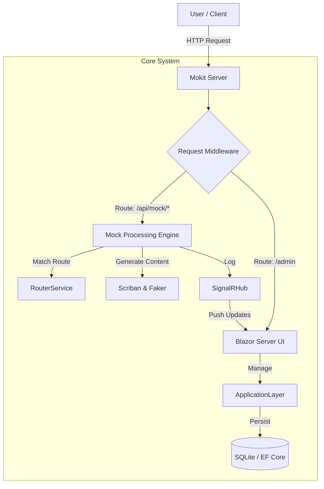

# 🏗️ Architecture Guide

## 📐 System Overview
Mokit is built on the **.NET 8** platform, utilizing **ASP.NET Core** for the backend and **Blazor Server** for the frontend UI. It follows a modular architecture to separate concerns between the UI, core logic, and data access.

### 🧩 High-Level Components

## 📂 Project Structure (`src/`)

The solution is organized into the following projects:

### 1. `Mokit.Domain`
*   **Role**: The core of the Clean Architecture. Contains enterprise logic and types.
*   **Contents**: Entities, Value Objects, Domain Events, Repository Interfaces.
*   **Dependencies**: None.

### 2. `Mokit.Application`
*   **Role**: Application business logic.
*   **Contents**: DTOs, Service Interfaces, Validators (FluentValidation), Business Rules.
*   **Dependencies**: `Mokit.Domain`.

### 3. `Mokit.Infrastructure`
*   **Role**: Implementation of interfaces defined in Application/Domain.
*   **Contents**: Entity Framework Core DbContext, Migrations, File System access, External Service implementations.
*   **Dependencies**: `Mokit.Application`, `Mokit.Domain`.

### 4. `Mokit.MockEngine`
*   **Role**: The heart of the mocking capability.
*   **Contents**:
    *   **Matching Logic**: Determining which mock endpoint matches an incoming HTTP request.
    *   **Response Generation**: Processing Scriban templates and generating dynamic data.
    *   **Scoped Execution**: Handling request-scoped variables and states.
*   **Dependencies**: `Mokit.Core` (effectively).

### 5. `Mokit.Web`
*   **Role**: The Entry point and UI.
*   **Contents**: Blazor Server Pages (`.razor`), Controllers (for API), Startup configuration (`Program.cs`).
*   **Dependencies**: All other layers.

### 6. `Mokit.HostManager`
*   **Role**: Dynamic mock server hosting and background services.
*   **Contents**:
    *   **MockHostInstance**: Individual mock server instances per project.
    *   **MockHostManager**: Manages lifecycle of mock server instances.
    *   **WebhookProcessingService**: Background service for processing outgoing webhooks.
*   **Dependencies**: `Mokit.Application`, `Mokit.MockEngine`.

## 🛠️ Key Technologies

| Category | Technology | Usage |
|----------|------------|-------|
| **Framework** | .NET 8 | Core platform. |
| **UI** | Blazor Server | Interactive web UI without writing JavaScript. |
| **Database** | SQLite | Lightweight, file-based storage for portability. Accessed via EF Core. |
| **Real-time** | SignalR | Pushing request logs to the dashboard in real-time. |
| **Templating** | Scriban | Fast, powerful text templating for dynamic responses. |
| **Data Fake** | Bogus | Generating fake data (names, addresses, etc.) in responses. |
| **Logging** | Serilog | Structured logging for system diagnostics. |

## 🧵 Request Lifecycle (Mock)

1.  **Ingress**: Request hits the middleware.
2.  **Identification**: Middleware checks if the path corresponds to a known Project alias.
3.  **Matching**: `MockEngine` scans project endpoints for a route match (method + path pattern).
4.  **Validation**: If validation rules are defined, request is validated before processing.
5.  **Processing**:
    *   Headers and delay settings are applied.
    *   Response body is parsed through the **Scriban** engine.
6.  **Logging**: Request details are saved and broadcasted via SignalR.
7.  **Response**: The generated HTTP response is sent back to the client.
8.  **Webhooks**: If configured, outgoing HTTP requests are queued and sent asynchronously.

